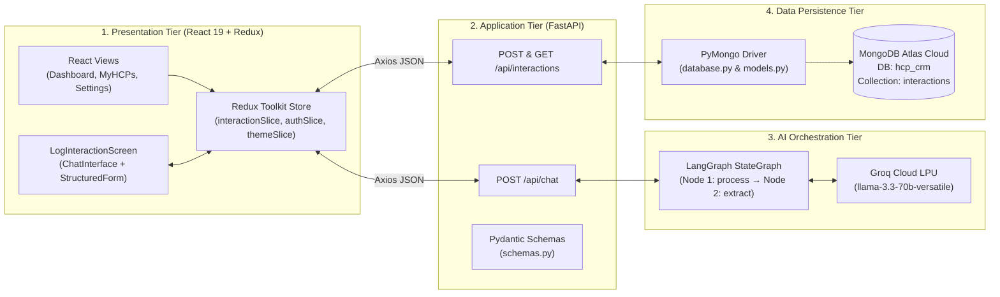

# 🩺 LifeSci CRM (HCP Sync): AI-First Healthcare Professional Management


An **AI-First Customer Relationship Management (CRM)** platform engineered specifically for **Pharmaceutical and Life Science Field Representatives**.

<<<<<<< HEAD
Instead of manually filling out repetitive post-meeting forms, field representatives can simply chat with the built-in AI assistant in natural language. A **LangGraph** state machine powered by **Groq (`llama-3.3-70b-versatile`)** automatically extracts structured entities (HCP Name, Specialty, Discussion Topics, Sentiment, Follow-up Date, and Notes), auto-populates the form in real time, and persists records as BSON documents in **MongoDB Atlas**.
=======
##  Features
>>>>>>> 69f799f927c326716b11b26b6b954bad5b6ffa12

---

## ✨ Key Features

- **🤖 Conversational AI Entity Extraction:** Chat naturally about doctor visits (e.g., *"Met Dr. Sarah Smith from Cardiology today to discuss Phase 3 trial results; sentiment was positive, follow up next Tuesday"*). The LangGraph workflow (`process` → `extract`) parses the conversation into structured JSON fields automatically.
- **🪟 Dual-Pane Interaction Logging:** Converse with the AI assistant on the left pane (`ChatInterface`) while watching the structured CRM form (`StructuredForm`) auto-populate in real time on the right pane, with full support for manual review and overrides.
- **☁️ MongoDB Atlas Cloud Persistence:** Stores interaction logs as native BSON documents in the `hcp_crm.interactions` collection via **PyMongo**, aligning directly with the JSON structures extracted by the AI agent.
- **📊 Executive Analytics Dashboard:** Real-time KPI summary cards tracking **Total Interactions**, **Unique HCPs**, **Positive Sentiment Count**, and **Follow-ups Pending**, alongside a reverse-chronological interaction feed.
- **👨‍⚕️ HCP Directory & Instant Search:** Automatically aggregates interactions by Healthcare Professional (`MyHCPs`), displaying specialty, interaction count, latest sentiment badge, recent discussion topics, and instant search filtering by name or specialty.
- **🎨 Modern SaaS UI with Light & Dark Modes:** Built with a custom CSS3 variable design system and Redux theme management (`themeSlice`), plus configurable profile, notification, security, and AI preferences.

---

## 🏗️ System Architecture



---

##  Technology Stack

| Layer | Technology / Package | Purpose |
| :--- | :--- | :--- |
| **Front-End** | React 19 (`react`, `react-dom`), Vite 8 | Component-based SPA and fast HMR bundler |
| **State & Routing** | Redux Toolkit (`@reduxjs/toolkit`), React Router v7 | Centralized state slices (`auth`, `interaction`, `theme`) & client routing |
| **UI & Icons** | CSS3 Custom Design System, `lucide-react` | Responsive Dual-Pane layout, Dark/Light themes, and vector icons |
| **HTTP Client** | `axios` | Asynchronous REST API communication with FastAPI |
| **Back-End API** | Python 3, FastAPI, Uvicorn, Pydantic | REST endpoints, ASGI server, CORS middleware, and schema validation |
| **AI & LLM** | `langgraph`, `langchain-groq`, `langchain-core` | Two-node `StateGraph` (`process` → `extract`) with Groq `llama-3.3-70b-versatile` |
| **Database** | **MongoDB Atlas** & `pymongo[srv]` | Cloud NoSQL document storage (`hcp_crm.interactions`) |
| **Dev Tools** | `oxlint`, `python-dotenv`, Git, Swagger UI (`/docs`) | Linting, environment config, version control, and API testing |

---

## 📂 Project Structure

```text
HCP Sync/
├── backend/
│   ├── agent.py             # LangGraph StateGraph (process & extract nodes) + Groq LLM setup
│   ├── database.py          # PyMongo MongoClient connection to MongoDB Atlas (hcp_crm)
│   ├── main.py              # FastAPI application & REST endpoints (/api/chat, /api/interactions)
│   ├── models.py            # MongoDB BSON document builder & ObjectId serializer helpers
│   ├── schemas.py           # Pydantic request/response validation schemas
│   ├── requirements.txt     # Python backend dependencies
│   └── .env                 # Environment variables (GROQ_API_KEY, MONGODB_URI, MONGODB_DB_NAME)
├── frontend/
│   ├── src/
│   │   ├── components/
│   │   │   ├── ChatInterface.jsx        # Conversational AI chat pane
│   │   │   ├── StructuredForm.jsx       # Real-time auto-populated HCP form
│   │   │   ├── LogInteractionScreen.jsx # Dual-pane interaction logging layout
│   │   │   ├── Dashboard.jsx            # Analytics KPIs & recent interactions feed
│   │   │   ├── MyHCPs.jsx               # Aggregated HCP directory & search filter
│   │   │   ├── LoginPage.jsx            # Representative authentication screen
│   │   │   └── Settings.jsx             # Profile, notifications, security & theme settings
│   │   ├── store/
│   │   │   ├── store.js                 # Redux store configuration
│   │   │   ├── interactionSlice.js      # Async thunks (sendChatMessage, saveInteraction)
│   │   │   ├── authSlice.js             # User session state
│   │   │   └── themeSlice.js            # Dark / Light mode state
│   │   ├── App.jsx                      # Sidebar, Topbar & protected route definitions
│   │   ├── main.jsx                     # React root entry point
│   │   └── index.css                    # Custom design system & theme CSS variables
│   ├── package.json
│   └── vite.config.js
├── HCP_Sync_Project_Documentation.pdf   # Full System Requirement, Analysis & Design Report
└── README.md
```

---

## 🗄️ MongoDB Atlas Document Schema (`hcp_crm.interactions`)

Each saved HCP interaction is stored in MongoDB Atlas as a BSON document with the following structure:

```json
{
  "_id": { "$oid": "67e92a1f8c4b1e2a3c9d0123" },
  "hcp_name": "Dr. Sarah Smith",
  "specialty": "Cardiology",
  "discussion_topics": "Phase 3 Clinical Trial Data & Dosage Guidelines",
  "follow_up_date": "Next Tuesday",
  "notes": "Requested sample starter packs for clinic.",
  "sentiment": "Positive",
  "created_at": { "$date": "2026-09-30T10:30:00.000Z" }
}
```

---

## 🔌 REST API Endpoints

| Method | Endpoint | Request Body / Params | Description |
| :--- | :--- | :--- | :--- |
| `POST` | `/api/chat` | `{ "message": str, "history": list }` | Invokes the LangGraph + Groq agent and returns `{ "response": str, "extracted_info": dict }`. |
| `POST` | `/api/interactions` | `InteractionCreate` JSON payload | Validates and inserts a new interaction document into MongoDB Atlas (`hcp_crm.interactions`). |
| `GET` | `/api/interactions` | `?skip=0&limit=100` | Retrieves logged interaction documents from MongoDB Atlas. |

---

##  Getting Started (Local Development)

### Prerequisites
- **Python 3.10+**
- **Node.js 18+** & **npm**
- **Groq API Key** — Get a free key at [console.groq.com](https://console.groq.com)
- **MongoDB Atlas URI** — Create a free M0 cluster at [mongodb.com/atlas](https://www.mongodb.com/atlas) (or use a local MongoDB instance)

### 1. Backend Setup
Navigate to the `backend` directory, create a virtual environment, and install dependencies:

```bash
cd backend
python -m venv venv

# Activate virtual environment (Windows)
.\venv\Scripts\activate
# Activate virtual environment (macOS / Linux)
# source venv/bin/activate

pip install -r requirements.txt
```

Create a `.env` file inside the `backend/` directory:

```env
GROQ_API_KEY=your_groq_api_key_here
MONGODB_URI=mongodb+srv://<username>:<password>@<cluster>.mongodb.net/hcp_crm?retryWrites=true&w=majority
MONGODB_DB_NAME=hcp_crm
```

Start the FastAPI backend server:

```bash
uvicorn main:app --reload
```
- Backend API: `http://localhost:8000`
- Interactive Swagger Docs: `http://localhost:8000/docs`

### 2. Frontend Setup
Open a new terminal and navigate to the `frontend` directory:

```bash
cd frontend
npm install
npm run dev
```
- Frontend Application: `http://localhost:5173`

---

<<<<<<< HEAD
## 🔒 Environment Variables

| Variable | Required | Description |
| :--- | :--- | :--- |
| `GROQ_API_KEY` | Yes | API key for Groq Cloud LPU inference (`llama-3.3-70b-versatile`). |
| `MONGODB_URI` | Yes | MongoDB Atlas connection string (`mongodb+srv://...`) or local MongoDB URI (`mongodb://localhost:27017`). |
| `MONGODB_DB_NAME` | Optional | Target MongoDB database name (defaults to `hcp_crm`). |

---
=======
##  Environment Variables
- `GROQ_API_KEY`: Required for the AI extraction engine to function. Get a free API key at [console.groq.com](https://console.groq.com).
>>>>>>> 69f799f927c326716b11b26b6b954bad5b6ffa12

##  License
This project is open-source and available under the MIT License.
